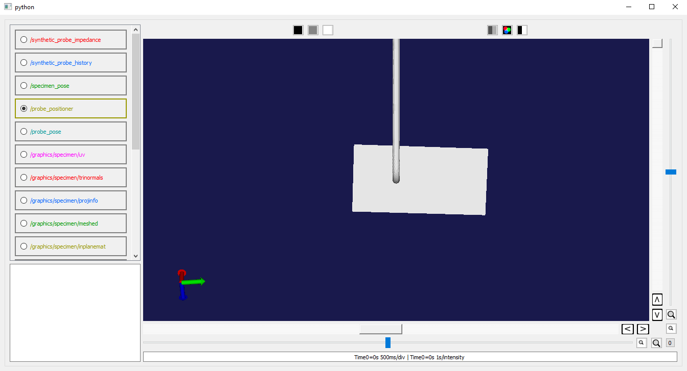
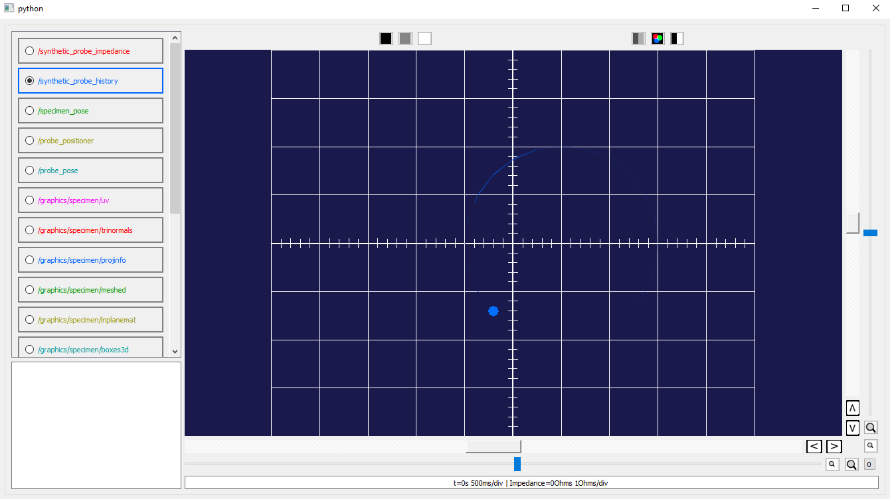
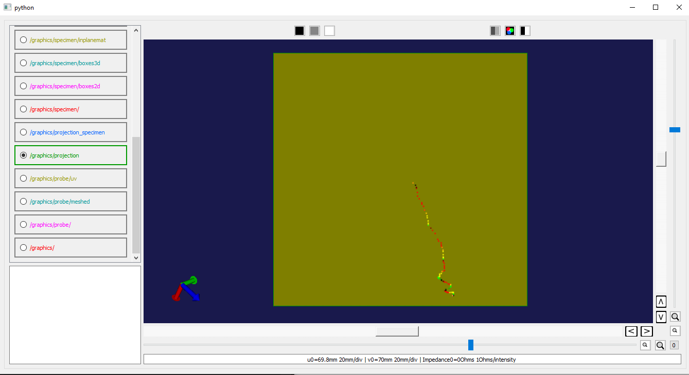
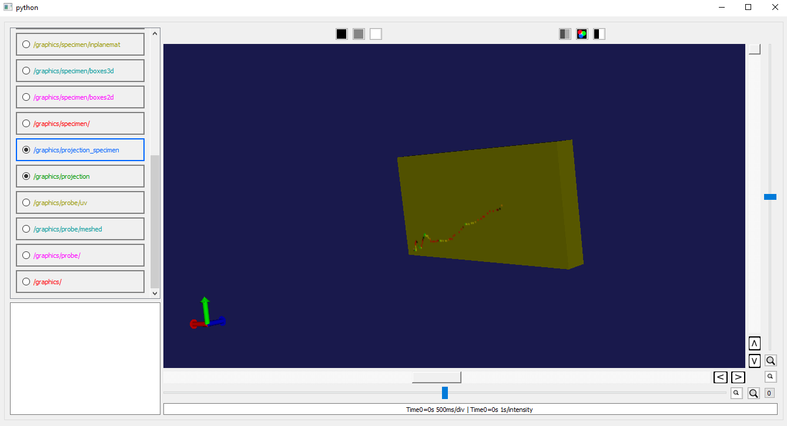

Tests and Examples
==================

The SpatialNDE2 package includes a number of tests and examples in both
C++ and Python. In general the tests and examples are designed to verify
internal functionality and/or illustrate proper use of the API.

The C++ test and example code is in the ``test/`` directory. The built
test binaries get installed into your build directory (Linux) or a
subdirectory of the build directory based on the build configuration
(e.g RelWithDebInfo/) on Windows.

Python test and example code is also in the ``test/`` directory but
it does NOT get installed. 

Building external Python-accessible C++ code: spatialnde2_example_cpp_function
------------------------------------------------------------------------------

SpatialNDE2 supports a plug-in architecture: Additional functionality can
be dynamically loaded in and will automatically register itself with
the library. If writing a C++ application, one way to accomplish this is to
explicitly link your application binary with the library containing additional
functionality. However at this time there is no C++ cross-platform method for
selecting and loading additional functionality at run time. You would use
LoadLibrary() on Windows or dlopen() on Linux/Apple.

Instead we can load external C++ code by wrapping it in a Python
module.  This provides an additional advantage: The use of the Python
package/module naming scheme for accessing the external code. An
example of this is given in the ``spatialnde2_example_cpp_function``
subdirectory, which contains an entire "external" C++ SpatialNDE2 math
function packaged using Python and the Cython C/C++ interface generator. 

Build and install this as you would any other Python package (it
must be built after the Python installation of SpatialNDE2 is performed
and if you update SpatialNDE2 this package will need to be completely
rebuilt and reinstalled). The ``recmath_test2.py`` example in the ``test``
directory demonstrates the use of this external C++ function. 

Specific tests/examples
-----------------------

C++ examples:

  * ``allocator_test.cpp``: Basic functional test of some of the memory
    allocator classes.
  * ``compositor_test.cpp``: Verify functionality of the
    OpenSceneGraph-based graphics compositor.
  * ``matrixsolve_test.cpp``: Verify correct operation of the ``fmatrixsolve()`` function
  * ``ondemand_test.cpp``: Verify correct functionality of "ondemand" math functions
  * ``osg_layerwindow_test.cpp``: Verify correct functionality of the openscenegraph_layerwindow class used to feed rendered graphics to the display compositor.
  * ``png_viewer.cpp``: Verify correct display of 2D images by loading .png graphics
  * ``recdb_test.cpp``: Simple example of creating a recording database and some recordings.
  * ``recmath_test.cpp``: Example of a simple math function that supports OpenCL-based GPU acceleration.
  * ``recmath_test2.cpp``: Example of a simple math function that is templated to support operating across multiple types.
  * ``transform_eval_test.cpp``: Demonstrates some Eigen matrix transformations to verify that the x3d implementation behaves correctly and consistently with Numpy calculations (see transform_eval_test.py).
  * ``x3d_viewer.cpp``: Demonstrate basic 3D rendering functionality by viewing an .x3d file
  * ``x3d_viewer_qt.cpp``: Demonstrate functionality of the QT-based recording viewer by viewing an .x3d file.

Python examples:

  * ``kdtree_test.py``:  Verify correct functionality of the kdtree and knn math functions.
  * ``qtrecviewer_test.py``: Demonstrate functionality of the python-wrapped QT recording viewer on a pointcloud and 1D waveform (NOTE: as of this writing 1D waveform support is not yet implemented)
  * ``recdb_test.py``: Simple example of creating a recording database and some recordings.
  * ``recmath_test2.py``: Example of loading an external math function. Requires ``spatialnde2_example_external_cpp_function`` to be installed. 
  * ``transform_eval_test.py``: Demonstrates some matrix transformations to verify that the x3d implementation behaves correctly and consistently between Eigen and Numpy calculations (see transform_eval_test.cpp).

Dataguzzler-Python examples (require Dataguzzler-Python to be installed for operation; run them with ``dataguzzler-python example.dgp``):
  * ``x3d_objectfollower.dgp``:  Demonstrates use of the qt_osg_compositor_view_tracking_pose_recording to define a view that can hold a particular object fixed relative to the camera. 
  * ``project_live_probe_tip_data.dgp``: Demonstrates CAD registration capability by tracking simulated eddy-current data over space and time and registering it to a 3-dimensional specimen.

Project Probe Tip Data User Guide
---------------------------------

The purpose of the ``project_live_probe_tip_data.dgp`` module is to demonstrate the spatial registration 
capability of SpatialNDE2 by viewing the data recorded by a probe in the context of the location on a
part or specimen where this data would origiate. This module can be found in the test directory of the SpatialNDE2 source tree.
The user can move the probe to some pose (rotation and translation) relative to the part/specimen that they would prefer, and
ray tracing is used to track which section of the part/specimen that the probe is pointing at over time. Records of the
data from the probe (simulated eddy current impedance data) are created at that location in the parameterization space 
(2-dimensional surface map) of the 3D model of the part/specimen the probe is pointing at. The locations of the
data in parameterization space are then used to put this data into a 3-dimensional context by rendering this
data on the surface of the 3D part/specimen model, which allows for registration of impedance data to the model
in a 3-dimensional context. Reading through the concepts section of the User Guide before running will be helpful in understanding
the core concepts behind the features of this script.

Step-by-step guide for usage:

1 (optional). Before running the example, select the probe and specimen 3D model files that you would like to use to accurately reflect your testing environment. Ensure that these files are meshed and in the Extensible 3D (``.x3d``) format. Then place these files in the working directory of the ``project_live_probe_tip_data.dgp`` file. Default models are assigned in the script if there are no models to use. The script can be set to read the models by changing the value of the ``specimen_model_file`` and ``probe_model_file`` variables.

2. Use the ``"/probe_positioner"`` channel to move the probe in a context where the probe is fixed relative to the camera and can be dragged around a specimen. For a third person view (not through the probe's perspective) of the specimen and the probe, 
select the ``/probe_pose`` channel.

3. A live visualization of simulated data from the probe can be found in the ``"/synthetic_probe_history"`` channnel, which displays the phase of a simulated signal, 
rotating in the complex plane, that would come from an eddy current probe. 

	
4. A surface-parameterization map of accumulated probe impedance data can be viewed using the ``"/graphics/projection"`` channel. The rendering of this
data is specially handled using the qt recording viewer. For information on the type of recording used to store this data, see the ``fusion_ndarray_recording``
subsection of the concepts section of the User Guide.

5. To see the simulated data mapped to the specimen in a 3-dimensional context, select the ``"/graphics/projection_specimen"`` channel.

     
